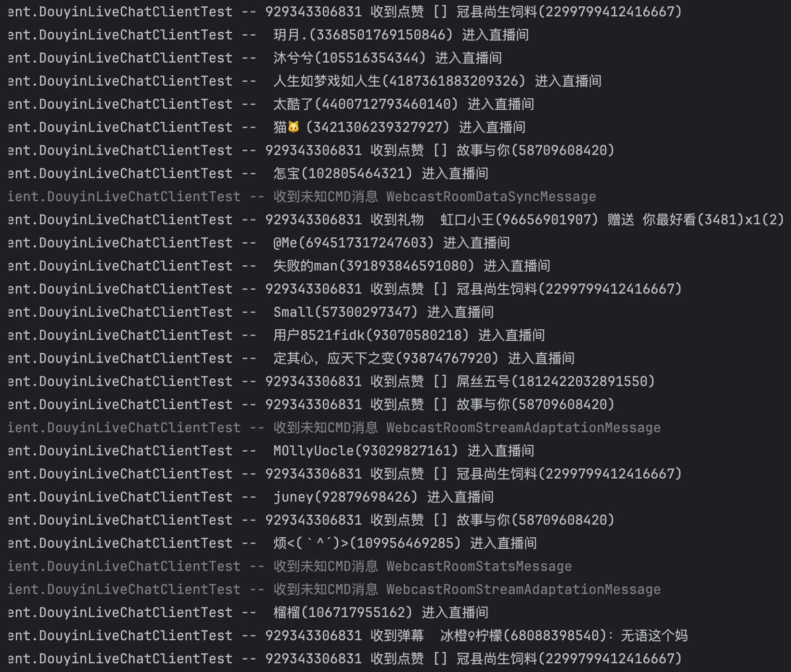
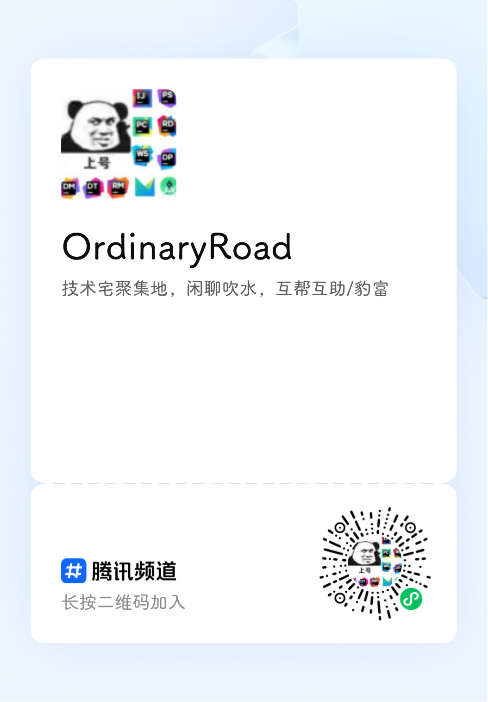

# ordinaryroad-live-chat-client

  

> This project is in progress... 👨‍💻，有问题欢迎[提交issuse](https://github.com/OrdinaryRoad-Project/ordinaryroad-live-chat-client/issues/new/choose)，
> 觉得有用的话可以点个小星星⭐️鼓励一下，感谢
>
> 如果对项目感兴趣也欢迎[加入频道](#交流讨论)交流讨论，
> 提交PR
>
> ToDo List: [https://github.com/orgs/OrdinaryRoad-Project/projects/1](https://github.com/orgs/OrdinaryRoad-Project/projects/1)
>
> **更新日志：**[https://github.com/OrdinaryRoad-Project/ordinaryroad-live-chat-client/releases](https://github.com/OrdinaryRoad-Project/ordinaryroad-live-chat-client/releases)
>
> [⭐BarrageFly——让弹幕飞](https://barragefly.ordinaryroad.tech/)，基于该项目的一个弹幕转发、过滤、处理平台
---

## 项目特色

- Feature 0: Netty
- Feature 1: 消息中的未知属性统一放到单独的MAP中（JSON格式消息）
- Feature 2: 支持自动重连
- Feature 3: 支持同时监听多个直播间
- Feature 4: 支持短直播间id
- Feature 5*: 支持弹幕发送、为主播点赞
- Feature 6*: 内置收到弹幕、收到礼物、收到醒目留言、用户入房、收到点赞、状态变化、统计信息、社交消息回调
- Feature 7: 支持消息转发
- Feature 8: 支持单独引入编解码模块
- Feature 9: 支持网络代理
- Feature 10*: 解析直播间信息

> *存在平台差异
> - ✅: 平台支持且已完成
> - ☑️️: 平台支持但未实现
> - ❌: 平台网页端暂不支持

## 平台适配情况表

| 平台          | LiveChatClient | Cookie | 短直播间id | 发送弹幕 | 为主播点赞 |
|-------------|----------------|--------|--------|------|-------|
| Bilibili B站 | ✅              | ✅      | ✅      | ✅    | ✅     |
| Douyu 斗鱼    | ✅              | ✅      | ✅      | ✅    | ❌     |
| Huya 虎牙     | ✅              | ✅      | ✅      | ✅    | ❌     |
| Douyin 抖音*  | ✅              | ☑️️    | ✅      | ☑️   | ☑️️   |
| Kuaishou 快手 | ✅              | ✅      | ✅      | ✅    | ✅     |
| Tiktok*     | ✅              | ✅      | ✅      | ☑️   | ☑️    |

> *暂未完全支持（Tiktok在测试中）

## 平台直播间信息适配情况表

| 平台          | 房间标题 | 房间描述 | 房间直播状态 | 房间直播流地址 |
|-------------|------|------|--------|---------|
| Bilibili B站 | ✅    |      | ✅      | ✅       |
| Douyu 斗鱼    | ✅    |      | ✅      | ✅       |
| Huya 虎牙     | ✅    |      | ✅      | ✅       |
| Douyin 抖音   | ✅    |      | ✅      | ✅       |
| Kuaishou 快手 | ✅    | ✅    | ✅      | ✅       |

## 平台直播间消息适配情况表

| 平台          | 弹幕 | 礼物        | 醒目留言 | 进入房间    | 点赞      | 状态变化 | 统计信息               | 社交消息     |
|-------------|----|-----------|------|---------|---------|------|--------------------|----------|
| Bilibili B站 | ✅  | ✅         | ✅    | ✅       | ✅       | ✅    | ✅（点赞数、当前人数、累计观看人数） |          |
| Douyu 斗鱼    | ✅  | ✅         | ✅    | ✅       | ❌       | ☑️   | ❌                  |          |
| Huya 虎牙     | ✅  | ✅         | ❌    | ✅（高级用户） | ❌       | ☑️   | ❌                  |          |
| Douyin 抖音   | ✅  | ✅         | ❌    | ✅       | ✅（点赞个数） | ✅    | ✅（点赞数、当前人数）        | ✅（分享、关注） |
| Kuaishou 快手 | ✅  | ✅（礼物信息不全） | ❌    | ❌       | ✅（首次点赞） | ❌    | ✅（点赞数、当前人数）        |          |
| Tiktok      | ✅  | ✅         | ❌    | ✅       | ✅（点赞个数） | ✅    | ✅（点赞数、当前人数）        | ✅（分享、关注） |

消息接口内置的方法见 [https://github.com/OrdinaryRoad-Project/ordinaryroad-live-chat-client/tree/main/live-chat-client-commons/live-chat-client-commons-base/src/main/java/tech/ordinaryroad/live/chat/client/commons/base/msg](https://github.com/OrdinaryRoad-Project/ordinaryroad-live-chat-client/tree/main/live-chat-client-commons/live-chat-client-commons-base/src/main/java/tech/ordinaryroad/live/chat/client/commons/base/msg)

运行效果图


---

## 0 原理

抓取浏览器的WebSocket二进制流，然后分析模拟浏览器的行为；这种方式的优点是不需要开发者认证，缺点是没有官方文档，分析过程比较费时费力，并且需要适配不同平台的流程变化（不会经常变化）

以后可能会考虑支持平台的开放协议

## 1 安装

> JDK ≥ 8

### B站

```xml

<dependency>
    <groupId>tech.ordinaryroad</groupId>
    <artifactId>live-chat-client-bilibili</artifactId>
    <!-- 参考github release版本，不需要前缀`v` -->
    <version>${ordinaryroad-live-chat-client.version}</version>
</dependency>
```

> Gradle用户注意：自从`0.3.2`版本开始，B站Client配置中，压缩方式默认为`NORMAL_BROTLI`，当使用Gradle引入时，还需要引入操作系统对应的brotli4j native包，详见：https://github.com/hyperxpro/Brotli4j?tab=readme-ov-file#gradle

例如：

```groovy
val liveChatClientBrotliVersion = "1.16.0"
// Windows
implementation("com.aayushatharva.brotli4j:native-windows-x86_64:$liveChatClientBrotliVersion")
implementation("com.aayushatharva.brotli4j:native-windows-aarch64:$liveChatClientBrotliVersion")
// Linux
implementation("com.aayushatharva.brotli4j:native-linux-armv7:$liveChatClientBrotliVersion")
implementation("com.aayushatharva.brotli4j:native-linux-aarch64:$liveChatClientBrotliVersion")
implementation("com.aayushatharva.brotli4j:native-linux-x86_64:$liveChatClientBrotliVersion")
implementation("com.aayushatharva.brotli4j:native-linux-s390x:$liveChatClientBrotliVersion")
implementation("com.aayushatharva.brotli4j:native-linux-riscv64:$liveChatClientBrotliVersion")
implementation("com.aayushatharva.brotli4j:native-linux-ppc64le:$liveChatClientBrotliVersion")
// Mac
implementation("com.aayushatharva.brotli4j:native-osx-aarch64:$liveChatClientBrotliVersion")
implementation("com.aayushatharva.brotli4j:native-osx-x86_64:$liveChatClientBrotliVersion")
```

如果引入后仍无法使用，请修改protover配置项，例如改为`NORMAL_ZLIB`：`BilibiliLiveChatClientConfig.builder().protover(ProtoverEnum.NORMAL_ZLIB).roomId("xxx").build()`

### 斗鱼

```xml

<dependency>
    <groupId>tech.ordinaryroad</groupId>
    <artifactId>live-chat-client-douyu</artifactId>
    <!-- 参考github release版本，不需要前缀`v` -->
    <version>${ordinaryroad-live-chat-client.version}</version>
</dependency>
```

### 虎牙

```xml

<dependency>
    <groupId>tech.ordinaryroad</groupId>
    <artifactId>live-chat-client-huya</artifactId>
    <!-- 参考github release版本，不需要前缀`v` -->
    <version>${ordinaryroad-live-chat-client.version}</version>
</dependency>
```

### 抖音

```xml

<dependency>
    <groupId>tech.ordinaryroad</groupId>
    <artifactId>live-chat-client-douyin</artifactId>
    <!-- 参考github release版本，不需要前缀`v` -->
    <version>${ordinaryroad-live-chat-client.version}</version>
</dependency>
```

> 注意，如果`StringEscapeUtils.unescapeJson`出现报错，尝试手动引入`"org.apache.commons:commons-lang3:3.14.0"`

### 快手

```xml

<dependency>
    <groupId>tech.ordinaryroad</groupId>
    <artifactId>live-chat-client-kuaishou</artifactId>
    <!-- 参考github release版本，不需要前缀`v` -->
    <version>${ordinaryroad-live-chat-client.version}</version>
</dependency>
```

## 2 使用

> 测试类包含了多种样例，可供参考

### 2.0 不同平台的CMD定义

- B站：[BilibiliCmdEnum](https://github.com/OrdinaryRoad-Project/ordinaryroad-live-chat-client/blob/main/live-chat-client-codec/live-chat-client-codec-bilibili/src/main/java/tech/ordinaryroad/live/chat/client/codec/bilibili/constant/BilibiliCmdEnum.java)
- 斗鱼：[DouyuCmdEnum](https://github.com/OrdinaryRoad-Project/ordinaryroad-live-chat-client/blob/main/live-chat-client-codec/live-chat-client-codec-douyu/src/main/java/tech/ordinaryroad/live/chat/client/codec/douyu/constant/DouyuCmdEnum.java)
- 虎牙：[HuyaCmdEnum](https://github.com/OrdinaryRoad-Project/ordinaryroad-live-chat-client/blob/main/live-chat-client-codec/live-chat-client-codec-huya/src/main/java/tech/ordinaryroad/live/chat/client/codec/huya/constant/HuyaCmdEnum.java)
- 抖音：[DouyinCmdEnum](https://github.com/OrdinaryRoad-Project/ordinaryroad-live-chat-client/blob/main/live-chat-client-codec/live-chat-client-codec-douyin/src/main/java/tech/ordinaryroad/live/chat/client/codec/douyin/constant/DouyinCmdEnum.java)
- 快手：[PayloadTypeOuterClass](https://github.com/OrdinaryRoad-Project/ordinaryroad-live-chat-client/blob/main/live-chat-client-codec/live-chat-client-codec-kuaishou/src/main/java/tech/ordinaryroad/live/chat/client/codec/kuaishou/protobuf/PayloadTypeOuterClass.java)

可以重写`onCmdMsg(收到的所有CMD消息)`或`onOtherCmdMsg(框架未处理的CMD消息)`回调方法，判断CMD来监听框架已经定义的CMD类型

如果要监听的消息枚举类中未定义，可以考虑重写`onUnknownCmdMsg(未知CMD消息)`方法

ICmdMsg类型转换对应关系

- B站：MessageMsg
- 斗鱼：DouyuCmdMsg
- 虎牙：WSPushMessage 或 WSMsgItem
- 抖音：DouyinCmdMsg
- 快手：KuaishouCmdMsg

```java

@Override
public void onOtherCmdMsg(BilibiliCmdEnum cmd, ICmdMsg<BilibiliCmdEnum> cmdMsg) {
    switch (cmd) {
        case GUARD_BUY: {
            // 有人上舰
            MessageMsg messageMsg = (MessageMsg) cmdMsg;
                ...
            break;
        }
        case SUPER_CHAT_MESSAGE_DELETE: {
            // 删除醒目留言
            MessageMsg messageMsg = (MessageMsg) cmdMsg;
                ...
            break;
        }
        default: {
            // ignore
        }
    }
}
```

### 2.1 Client模式

> Spring Boot 示例 [client-example](https://github.com/OrdinaryRoad-Project/ordinaryroad-live-chat-client/tree/main/live-chat-client-examples/client-example)

1. 创建配置
2. 创建Client并传入配置、添加消息回调
3. 开始监听直播间

> 如果需要查看其他平台的效果，请将`Bilibili`改为其他平台对应的英文，并修改消息回调接口的函数签名

```java
public class ClientModeExample {
    public static void main(String[] args) {
        String cookie = System.getenv("cookie");
        // 1. 创建配置
        BilibiliLiveChatClientConfig config = BilibiliLiveChatClientConfig.builder()
                // TODO 消息转发地址
                .forwardWebsocketUri("")
                // TODO 浏览器Cookie
                .cookie(cookie)
                // TODO 直播间id（支持短id）
                .roomId(7777)
                .build();

        // 2. 创建Client并传入配置、添加消息回调
        BilibiliLiveChatClient client = new BilibiliLiveChatClient(config, new IBilibiliMsgListener() {
            @Override
            public void onDanmuMsg(BilibiliBinaryFrameHandler binaryFrameHandler, DanmuMsgMsg msg) {
                IBilibiliMsgListener.super.onDanmuMsg(binaryFrameHandler, msg);
                System.out.printf("%s 收到弹幕 %s %s(%s)：%s\n", binaryFrameHandler.getRoomId(), msg.getBadgeLevel() != 0 ? msg.getBadgeLevel() + msg.getBadgeName() : "", msg.getUsername(), msg.getUid(), msg.getContent());
            }

            @Override
            public void onGiftMsg(BilibiliBinaryFrameHandler binaryFrameHandler, SendGiftMsg msg) {
                IBilibiliMsgListener.super.onGiftMsg(binaryFrameHandler, msg);
                System.out.printf("%s 收到礼物 %s %s(%s) %s %s(%s)x%s(%s)\n", binaryFrameHandler.getRoomId(), msg.getBadgeLevel() != 0 ? msg.getBadgeLevel() + msg.getBadgeName() : "", msg.getUsername(), msg.getUid(), msg.getData().getAction(), msg.getGiftName(), msg.getGiftId(), msg.getGiftCount(), msg.getGiftPrice());
            }

            @Override
            public void onSuperChatMsg(BilibiliBinaryFrameHandler binaryFrameHandler, SuperChatMessageMsg msg) {
                IBilibiliMsgListener.super.onSuperChatMsg(binaryFrameHandler, msg);
                System.out.printf("%s 收到醒目留言 %s(%s)：%s\n", binaryFrameHandler.getRoomId(), msg.getUsername(), msg.getUid(), msg.getContent());
            }

            @Override
            public void onEnterRoomMsg(InteractWordMsg msg) {
                System.out.printf("%s %s(%s) 进入直播间\n", msg.getBadgeLevel() != 0 ? msg.getBadgeLevel() + msg.getBadgeName() : "", msg.getUsername(), msg.getUid());
            }

            @Override
            public void onLikeMsg(BilibiliBinaryFrameHandler binaryFrameHandler, LikeInfoV3ClickMsg msg) {
                IBilibiliMsgListener.super.onLikeMsg(binaryFrameHandler, msg);
                System.out.printf("%s 收到点赞 %s %s(%s)\n", binaryFrameHandler.getRoomId(), msg.getBadgeLevel() != 0 ? msg.getBadgeLevel() + msg.getBadgeName() : "", msg.getUsername(), msg.getUid());
            }

            @Override
            public void onLiveStatusMsg(BilibiliBinaryFrameHandler binaryFrameHandler, BilibiliLiveStatusChangeMsg msg) {
                IBilibiliMsgListener.super.onLiveStatusMsg(binaryFrameHandler, msg);
                System.out.printf("%s 状态变化 %s\n", binaryFrameHandler.getRoomId(), msg.getLiveStatusAction());
            }

            @Override
            public void onRoomStatsMsg(BilibiliBinaryFrameHandler binaryFrameHandler, BilibiliRoomStatsMsg msg) {
                IBilibiliMsgListener.super.onRoomStatsMsg(binaryFrameHandler, msg);
                System.out.printf("%s 统计信息 累计点赞数: %s, 当前观看人数: %s, 累计观看人数: %s\n", binaryFrameHandler.getRoomId(), msg.getLikedCount(), msg.getWatchingCount(), msg.getWatchedCount());
            }
        });

        // 添加客户端连接状态回调
        client.addStatusChangeListener((evt, oldStatus, newStatus) -> {
            if (newStatus == ClientStatusEnums.CONNECTED) {
                // TODO 要发送的弹幕内容，请注意控制发送频率；框架内置支持设置发送弹幕的最少时间间隔，小于时将忽略该次发送
                client.sendDanmu("666666" + RandomUtil.randomNumbers(1));
            }
        });

        // 3. 开始监听直播间
        client.connect();
    }
}
```

#### 2.1.1 Client相关API

- 连接
  - `void connect(Runnable success, Consumer<Throwable> failed)`
  - `void connect(Runnable success)`
  - `void connect()`
- 断开连接
  - `void disconnect(boolean cancelReconnect)`
  - `void disconnect()`
- 销毁
  - `void destroy()`
- 发送消息
  - `void send(Object msg, Runnable success, Consumer<Throwable> failed)`
  - `void send(Object msg, Runnable success)`
  - `void send(Object msg, Consumer<Throwable> failed)`
  - `void send(Object msg)`
- 发送弹幕
  - `void sendDanmu(Object danmu, Runnable success, Consumer<Throwable> failed)`
  - `void sendDanmu(Object danmu, Runnable success)`
  - `void sendDanmu(Object danmu, Consumer<Throwable> failed)`
  - `void sendDanmu(Object danmu)`
- 为主播点赞
  - `void clickLike(int count, Runnable success, Consumer<Throwable> failed)`
  - `void clickLike(int count, Runnable success)`
  - `void clickLike(int count, Consumer<Throwable> failed)`
  - `void clickLike(int count)`
- 添加消息监听器
  - `boolean addMsgListener(MsgListener msgListener)`
  - `boolean addMsgListeners(List<MsgListener> msgListeners)`
- 移除消息监听器
  - `boolean removeMsgListener(MsgListener msgListener)`
  - `boolean removeMsgListeners(List<MsgListener> msgListeners)`
- 获取当前状态
  - `ClientStatusEnums getStatus()`
- 添加状态变化监听器
  - `void addStatusChangeListener(IClientStatusChangeListener listener)`
- 移除状态变化监听器
  - `void removeStatusChangeListener(IClientStatusChangeListener listener)`
- 获取 Client 配置信息
  - `BaseLiveChatClientConfig getConfig()`
- 获取房间信息
  - `IRoomInitResult getRoomInitResult()`

#### 2.1.2 房间信息 IRoomInitResult 相关 API

- 获取房间标题
  - `String getTitle()`
- 获取房间描述
  - `String getDescription()`
- 获取房间直播状态
  - `RoomLiveStatusEnum getRoomLiveStatus()`
- 获取房间直播流地址
  - `List<IRoomLiveStreamInfo> getRoomLiveStreamUrls(RoomLiveStreamQualityEnum... qualities)`
  - `Map<RoomLiveStreamQualityEnum, List<String>> getRoomLiveStreamUrlMap(RoomLiveStreamQualityEnum... qualities)`

### 2.2 高级模式

> 参考 [BilibiliHandlerModeExample](https://github.com/OrdinaryRoad-Project/ordinaryroad-live-chat-client/tree/main/live-chat-client-examples/handler-example/src/main/java/tech/ordinaryroad/live/chat/client/example/handler/BilibiliHandlerModeExample.java)

### 2.3 单独引入编解码模块

> 参考 [codec-example](https://github.com/OrdinaryRoad-Project/ordinaryroad-live-chat-client/tree/main/live-chat-client-examples/codec-example/src/main/java/tech/ordinaryroad/live/chat/client/example/codec/BilibiliCodecExample.java)

B站示例，其他平台只需修改`bilibili`即可
> 使用Gradle引入B站编解码模块时，参考[#B站](#B站)

```xml

<dependency>
    <groupId>tech.ordinaryroad</groupId>
    <artifactId>live-chat-client-codec-bilibili</artifactId>
    <!-- 参考github release版本，不需要前缀`v` -->
    <version>${ordinaryroad-live-chat-client.version}</version>
</dependency>
```

### 2.4 设置代理

> 生效范围：仅项目自身，不会影响引用该项目的父项目

在代码中修改Config`socks5ProxyHost("127.0.0.1")`, `socks5ProxyPort("1080")`

身份认证（暂未测试）

- `socks5ProxyUsername("username")`, `socks5ProxyPassword("password")`

## 交流讨论

扫描二维码加入QQ/微信频道，或点击链接加入QQ频道【OrdinaryRoad】：https://pd.qq.com/s/3id0n7fvs




## 捐赠

> 开源不易，您的认可与支持是我不断更新的最大动力！
>
> 

| 日期         | 捐赠人 |    金额 | 留言      | 渠道  |
|------------|----:|------:|:--------|-----|
| 2024-03-06 | **睿 | 88.88 | 佬 加油    | ZFB |
| 2024-03-10 | **豪 |  88.8 | 大佬加油    | ZFB |
| 2024-03-25 | **波 | 188.8 | /       | ZFB |
| 2024-04-02 | **豪 |    30 | /       | ZFB |
| 2024-04-30 |  *h |   100 | 大佬牛逼    | WX  |
| 2024-11-18 |  *磊 |   200 | /       | WX  |
| 2025-01-04 |  *n |  18.8 | 天冷喝咖啡☕️ | QQ  |
| 2025-01-14 |  *n |  28.8 | 加油️     | QQ  |                    
| ...        | ... |   ... | ...     | ... |

## Star History

<a href="https://star-history.com/#OrdinaryRoad-Project/ordinaryroad-live-chat-client&Date">

  <picture>
    <source media="(prefers-color-scheme: dark)" srcset="https://api.star-history.com/svg?repos=OrdinaryRoad-Project/ordinaryroad-live-chat-client&type=Date&theme=dark" />
    <source media="(prefers-color-scheme: light)" srcset="https://api.star-history.com/svg?repos=OrdinaryRoad-Project/ordinaryroad-live-chat-client&type=Date" />
    
  </picture>
</a>

## 感谢

- [douyu-crawler-demo](https://github.com/cj1128/douyu-crawler-demo)（斗鱼登录状态的请求包构建）
- [Kain-90/huya-danmu](https://github.com/Kain-90/huya-danmu)
  （虎牙流程参考，最新lib库[vplayerUI.js](https://a.msstatic.com/huya/h5player/room/2309271152/vplayerUI.js)、[taf-signal.global.0.0.4.prod.js](https://hd2.huya.com/fedbasic/huyabaselibs/taf-signal/taf-signal.global.0.0.4.prod.js)）
- [saermart/DouyinLiveWebFetcher](https://github.com/saermart/DouyinLiveWebFetcher)（抖音流程参考）
- https://blog.ordinaryroad.tech/1/article/1743829866426630144 （快手直播间WebSocket的Protobuf协议分析）

## 免责声明

免责声明：仅供学术研究使用。对于违反相关法律、造成危害的滥用行为，开发者不负任何责任。

## 另附各个平台的开放平台地址

- B站开放平台：https://openhome.bilibili.com
- 斗鱼开放平台：https://open.douyu.com
- 虎牙开放平台：https://open.huya.com
- 快手开放平台：https://open.kuaishou.com
- 抖音开放平台：https://open.douyin.com

---
Keywords: 弹幕抓取 弹幕爬取 弹幕爬虫
